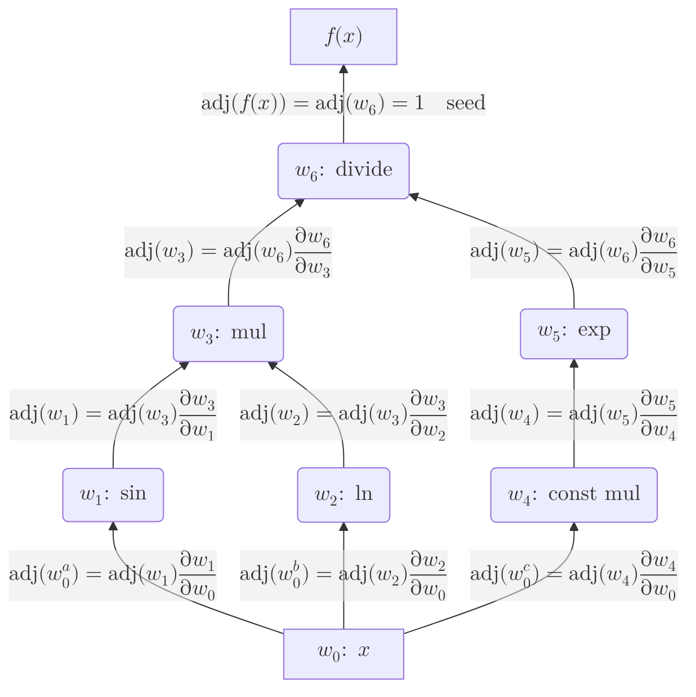
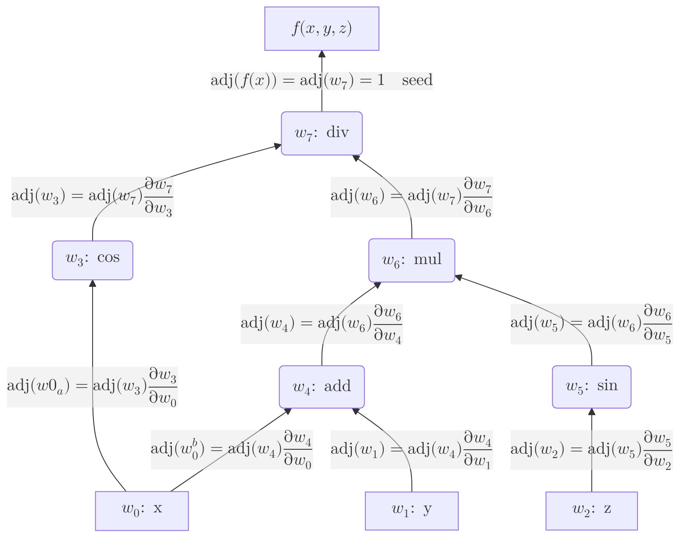

# Reverse Mode Automatic Differentiation

Support for first and second-order, reverse mode autodiff is provided by gradient and Hessian tapes.

## First Order

### Gradient Tapes

Gradient tapes keep track of operations for autodiff; unlike forward-mode autodiff, tracking is required since gradients have to be calculated in reverse order. To begin using reverse-mode autodiff, we must create a gradient tape and assign it variables to track. These variables will be passed into and returned from methods that will compute the local gradients for us and record them on the tape.

```csharp
using Mathematics.NET.AutoDiff;
using Mathematics.NET.Core;

GradientTape<Real> tape = new();
var x = tape.CreateVariable(1.23);
```

We also have to pass in an initial value—the point at which the gradients are calculated—to the variable creation method. If we want to track multiple variables, we can simply write
```csharp
GradientTape<Real> tape = new();
var x = tape.CreateVariable(1.23);
var y = tape.CreateVariable(0.66);
// Add more variables as needed.
```
and so on. To simplify this process, we may choose to create a vector of variables.
```csharp
AutoDiffVector3 x = tape.CreateAutoDiffVector(1.23, 0.66, 2.34);
```
Once we are satisfied, we may use these in our equations.

### Single-Variable Equations

Suppose we want to compute the derivative of the function
$$
    f(x) = \frac{\sin{x}\ln{x}}{e^{-x}}\quad\text{for }x>0
$$
at the point $ x=1.23 $. We can write
```csharp
using Mathematics.NET.AutoDiff;
using Mathematics.NET.Core;

GradientTape<Real> tape = new();
var x = tape.CreateVariable(1.23);

var result = tape.Divide(
    tape.Multiply(tape.Sin(x), tape.Ln(x)),
    tape.Exp(
        tape.Multiply(-Real.One, x)));
```
which will give us the value of the function at our specified point. At this moment, the derivative has not been calculated, but we are, however, able to examine the nodes which have been added to our tape. We can use [LogNodes](xref:Mathematics.NET.AutoDiff.GradientTape`1.LogNodes*) to do so, provided we have set up a logger.
```csharp
using Microsoft.Extensions.Logging;

using var loggerFactory = LoggerFactory.Create(builder => builder.AddConsole());
var logger = loggerFactory.CreateLogger<GradientTape<Real>>();

tape.LogNodes(logger, CancellationToken.None);
```
Here, we pass in a cancellation token in case the gradient tape is too large and we do not want to log all of the nodes onto the console. We can also set a limit on how many nodes are logged to the console (by default, this value is 100).
```csharp
tape.LogNodes(logger, CancellationToken.None, 25);
```
Using this on our gradient tape will give us the following output, which has been summarized:
```
Root Node 0:
    Weights: [0, 0]
    Parents: [0, 0]

Node 1:
    Weights: [0.3342377271245026, 0]
    Parents: [0, 1]
Node 2:
    Weights: [0.8130081300813008, 0]
    Parents: [0, 2]
Node 3:
    Weights: [0.20701416938432612, 0.9424888019316975]
    Parents: [1, 2]
Node 4:
    Weights: [-1, 0]
    Parents: [0, 4]
Node 5:
    Weights: [0.2922925776808594, 0]
    Parents: [4, 5]
Node 6:
    Weights: [3.4212295362896734, -2.2837086494091605]
    Parents: [3, 5]
```
The root node represents the variable we are currently tracking. Nodes from unary operations will provide one weight and parent, while nodes from binary operations will provide two weights and parents. This may be helpful when we want to determine which node came from which operation. (For performance reasons, the names of these methods are not tracked.) Below is a graph representation of the nodes on our gradient tape:

We can then calculate the gradient of our function by using [ReverseAccumulate](xref:Mathematics.NET.AutoDiff.GradientTape`1.ReverseAccumulate(System.ReadOnlySpan{`0}@)).
```csharp
tape.ReverseAccumulate(out var gradient);
```
Since this is a single variable equation, we can access the first element of `gradients` to get our result.
```csharp
Console.WriteLine(gradient[0]);
```
The correct value for the derivative should be `3.525753368769319`. The complete code looks as follows:
```csharp
using Mathematics.NET.AutoDiff;
using Mathematics.NET.Core;

GradientTape<Real> tape = new();
var x = tape.CreateVariable(1.23);

var result = tape.Divide(
    tape.Multiply(tape.Sin(x), tape.Ln(x)),
    tape.Exp(
        tape.Multiply(-Real.One, x)));

// Optional: examine the nodes on the gradient tape
tape.LogNodes(logger, CancellationToken.None);

tape.ReverseAccumulate(out var gradient);

// The value of the function at the point x = 1.23: 0.6675110878078776
Console.WriteLine("Value: {0}", result);
// The derivative of the function with respect to x at the point x = 1.23: 3.525753368769319
Console.WriteLine("Derivative: {0}", gradient[0]);
```

### Multivariable Equations

The multivariable case is as simple as the single variable case; we only need to track more variables on our gradient tape.
```csharp
using Mathematics.NET.AutoDiff;

GradientTape<Real> tape = new();
var x = tape.CreateVariable(1.23);
var y = tape.CreateVariable(0.66);
var z = tape.CreateVariable(2.34);
```
Now, if we wanted to compute the gradient of the function
$$
    f(x,y,z) = \frac{\cos{x}}{(x+y)\sin{z}}
$$
at the points we have chosen, $ x=1.23 $, $ y=0.66 $, and $ z=2.34 $, we can write
```csharp
var result = tape.Divide(
    tape.Cos(x.X1),
    tape.Multiply(
        tape.Add(x.X1, x.X2),
        tape.Sin(x.X3)));
```
If we want to examine the nodes, we can use `LogNodes` once again.
```
Root Node 0:
    Weights: [0, 0]
    Parents: [0, 0]
Root Node 1:
    Weights: [0, 0]
    Parents: [1, 1]
Root Node 2:
    Weights: [0, 0]
    Parents: [2, 2]

Node 3:
    Weights: [-0.9424888019316975, 0]
    Parents: [0, 3]
Node 4:
    Weights: [1, 1]
    Parents: [0, 1]
Node 5:
    Weights: [-0.695563326462902, 0]
    Parents: [2, 5]
Node 6:
    Weights: [0.7184647930691263, 1.8900000000000001]
    Parents: [4, 5]
Node 7:
    Weights: [0.7364320899293144, -0.18126788958785509]
    Parents: [3, 6]
```
Notice that there are now three root nodes, each representing the variables $ x $, $ y $, and $ z $, respectively. Here is a graph representation of our nodes:

As before, we can use `ReverseAccumulate` to get our gradients
```csharp
tape.ReverseAccumulate(out var gradient);
```
and log them to the console with
```csharp
using Mathematics.NET.LinearAlgebra;

// code

Console.WriteLine(gradient.ToDisplayString());
```
This will log the following to the console:
```
[-0.8243135949243512,  -0.13023459678281554, 0.2382974299363868    ]
```
which, for clarity, is
$$
\begin{align}
  \begin{split}
    \frac{\partial}{\partial x}f(x,y,z) &   =-\frac{\csc{z}}{x+y}\left(\frac{\cos{x}}{x+y}+\sin{x}\right) \\
    \frac{\partial}{\partial y}f(x,y,z) &   =-\frac{\cos{x}\csc{x}}{(x+y)^2} \\
    \frac{\partial}{\partial z}f(x,y,z) &   =-\frac{\cos{x}\cot{z}\csc{z}}{x+y}
  \end{split}
\end{align}
$$

#### AutoDiff Vectors

Instead of tracking $ x $, $ y $, and $ z $ individually, we can create a vector of variables.
```csharp
tape.CreateAutoDiffVector(1.23, 0.66, 2.34);
```
We can use this to calculate, for example, a Jacobian-vector product with the vector functions
$$
\begin{align}
    f_1(\textbf{x}) &   =\sin(x_1)(\cos(x_2)+\sqrt{x_3})    \\
    f_2(\textbf{x}) &   =\sqrt{x_1+x_2+x_3} \\
    f_3(\textbf{x}) &   =\sinh\left(\frac{e^xy}{z}\right)
\end{align}
$$
and the vector $ \textbf{v} = (0.23, 1.57, -1.71) $ for $ x_1,x_2,x_3>0 $.
```
using Mathematics.NET.AutoDiff;

GradientTape<Real> tape = new();
var x = tape.CreateAutoDiffVector(1.23, 0.66, 2.34);
Vector3<Real> v = new(0.23, 1.57, -1.71);

var result = tape.JVP(F1, F2, F3, x, v);

Console.WriteLine(result);

// f(x, y, z) = Sin(x) * (Cos(y) + Sqrt(z))
static Variable F1(GradientTape tape, AutoDiffVector3 x)
{
    return tape.Multiply(
        tape.Sin(x.X1),
        tape.Add(tape.Cos(x.X2), tape.Sqrt(x.X3)));
}

// f(x, y, z) = Sqrt(x + y + z)
static Variable F2(GradientTape tape, AutoDiffVector3 x)
{
    return tape.Sqrt(
        tape.Add(
            tape.Add(x.X1, x.X2),
            x.X3));
}

// f(x, y, z) = Sinh(Exp(x) * y / z)
static Variable F3(GradientTape tape, AutoDiffVector3 x)
{
    return tape.Sinh(
        tape.Multiply(
            tape.Exp(x.X1),
            tape.Divide(x.X2, x.X3)));
}
```
Note that this time, we do not call the method `ReverseAccumulate`. This should give us the following result: `(-1.2556937075301358, 0.021879748724684178, 4.842981131678516)`.

### Complex Variables

We can also work with complex numbers and complex derivatives by specifying [Complex](xref:Mathematics.NET.Core.Complex) as a type parameter when we create our gradient tape. Suppose we want to find the gradient of the function:
$$
    f(z,w)  =   \cos(\sin(z)\sqrt{w})
$$
at the points $ z=1.23+i2.34 $ and $ w=-0.66+i0.23 $. We can write
```csharp
using Mathematics.NET.AutoDiff;
using Mathematics.NET.Core;

GradientTape<Complex> tape = new();
var z = tape.CreateVariable(new(1.23, 2.34));
var w = tape.CreateVariable(new(-0.66, 0.23));

var result = tape.Cos(
    tape.Multiply(
        tape.Sin(z),
        tape.Sqrt(w)));

// Optional: examine the nodes on the gradient tape
tape.LogNodes(logger, CancellationToken.None);
Console.WriteLine();

tape.ReverseAccumulate(out var gradient);

// The value of the function at the point z = 1.23 + i2.34 and w = -0.66 + i0.23
Console.WriteLine("Value: {0}", result);
// The gradient of the function: ∂f/∂z and ∂f/∂w, respectively
Console.WriteLine("Gradient: {0}", gradient.ToDisplayString());
```
which is almost the exact same code we would have written in the real case. (Note that some methods such as `Atan2` are not available for complex gradient tapes.) This should output the following to the console:
```
Root Node 0:
    Weights: [(0, 0), (0, 0)]
    Parents: [0, 0]
Root Node 1:
    Weights: [(0, 0), (0, 0)]
    Parents: [1, 1]

Node 2:
    Weights: [(1.7509986221653533, -4.84670574511495), (0, 0)]
    Parents: [0, 2]
Node 3:
    Weights: [(0.09980501743235655, -0.5896861208610882), (0, 0)]
    Parents: [1, 3]
Node 4:
    Weights: [(0.13951299258538988, 0.8242959875555208), (4.937493465463717, 1.7188022913039218)]
    Parents: [2, 3]
Node 5:
    Weights: [(24.762656886395174, -27.774291395591305), (0, 0)]
    Parents: [4, 5]

Value: (27.784322505370138, 24.753716703326287)
Gradient: [(126.28638563049401, -98.74954259806483),  (-38.801295827094066, -109.6878698782088)  ]
```

### Custom Operations

If there is a function we need that is not provided in the class, we are still able to use it for our gradient tape provided we know its derivative. Suppose, for example, we did not have the `Sin` method. Since we know its derivative is `Cos`, we could write the following:
```csharp
GradientTape tape = new();
var x = tape.CreateVariable(1.23);

var result = tape.CustomOperation(
    x,                 // A variable
    x => Real.Sin(x),  // The function
    x => Real.Cos(x)); // The derivative of the function

tape.ReverseAccumulate(out var gradient);
Console.WriteLine("Value: {0}", result);
Console.WriteLine("Gradient: {0}", gradient.ToDisplayString());
```
For custom binary operations, we can write
```csharp
_ = tape.CustomOperation(
    x,
    y,
    (x, y) => // f(x, y)
    (x, y) => // ∂f/∂x
    (x, y) => // ∂f/∂y
);
```

:::info

Using variables in loops is not recommended since each iteration will add a node to the tape. If the derivative of the operation is known ahead of time, it may be possible to avoid this problem by using custom operations.

:::

## Second Order

### Hessian Tapes

The steps needed to perform second-order, reverse-mode autodiff is similar to the steps needed to perform the first-order case. This time, however, we have access to the following overloads and/or versions of [ReverseAccumulate](xref:Mathematics.NET.AutoDiff.HessianTape`1.ReverseAccumulate*):
```csharp
HessianTape<Complex> tape = new();

// Do some math...

// Use when we are only interested in the gradient
tape.ReverseAccumulate(out ReadOnlySpan<Complex> gradient);
// Use when we are only interested in the Hessian
tape.ReverseAccumulate(out ReadOnlySpan2D<Complex> hessian);
// Use when we are interested in both the gradient and Hessian
tape.ReverseAccumulate(out var gradient, out var hessian);
```
The last version may be useful for calculations such as finding the Laplacian of a scalar function in spherical coordinates which involves derivatives of first and second orders:
$$
\begin{align}
  \begin{split}
    \nabla^2f(r,\theta,\phi) & =\frac{1}{r^2}\frac{\partial}{\partial r}\left(r^2\frac{\partial f}{\partial r}\right)+\frac{1}{r^2\sin{\theta}}\frac{\partial}{\partial\theta}\left(\sin{\theta}\frac{\partial f}{\partial\theta}\right)+\frac{1}{r^2\sin^2{\theta}}\frac{\partial^2f}{\partial\phi^2} \\
    & =\frac{2}{r}\frac{\partial f}{\partial r}+\frac{\partial^2f}{\partial r^2}+\frac{1}{r^2\sin{\theta}}\left(\cos{\theta}\frac{\partial f}{\partial\theta}+\sin{\theta}\frac{\partial^2f}{\partial\theta^2}\right)+\frac{1}{r^2\sin^2{\theta}}\frac{\partial^2f}{\partial\phi^2}
  \end{split}
\end{align}
$$
Note that, in the future, we will not have to do this manually since there will be a method made specifically to compute Laplacians in spherical coordinates. For now, if we wanted to compute the Laplacian of the function
$$
    f(r,\theta,\phi) = \frac{\cos{r}}{(r+\theta)\sin{\phi}}
$$
we can write
```csharp
using Mathematics.NET.AutoDiff;
using Mathematics.NET.Core;

HessianTape<Real> tape = new();
var x = tape.CreateAutoDiffVector(1.23, 0.66, 0.23);

// f(r, θ, ϕ) = cos(r) / ((r + θ) * sin(ϕ))
_ = tape.Divide(
        tape.Cos(x.X1),
        tape.Multiply(
            tape.Add(x.X1, x.X2),
            tape.Sin(x.X3)));

tape.ReverseAccumulate(out var gradient, out var hessian);

// Manual Laplacian computation
var u = Real.One / (x.X1.Value * Real.Sin(x.X2.Value)); // 1 / (r * sin(θ))
var laplacian = 2.0 * gradient[0] / x.X1.Value +
                hessian[0, 0] +
                u * Real.Cos(x.X2.Value) * gradient[1] / x.X1.Value +
                hessian[1, 1] / (x.X1.Value * x.X1.Value) +
                u * u * hessian[2, 2];

Console.WriteLine(laplacian);
```
which should give us `48.80966092022821`.
