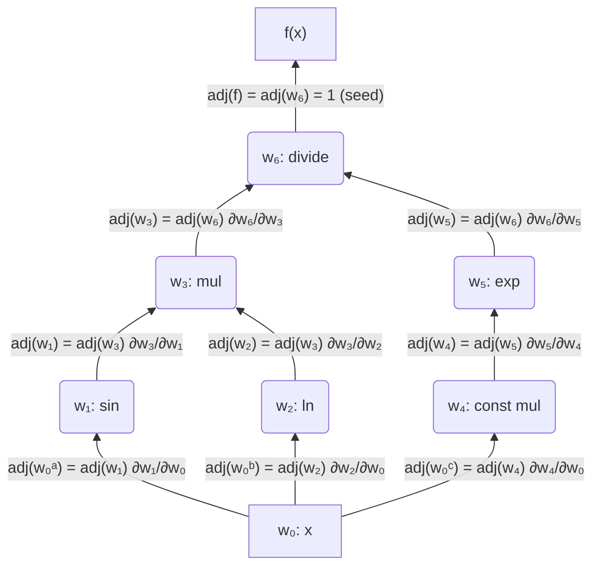

# First-Order, Reverse-Mode Automatic Differentiation

Support for first-order, reverse-mode automatic differentiation (autodiff) is provided by the @Mathematics.NET.AutoDiff.GradientTape class.

## Gradient tapes

Gradient tapes keep track of operations for autodiff; unlike forward-mode autodiff, tracking is required since gradients have to be calculated in reverse order. To begin using reverse-mode autodiff, we must create a gradient tape and assign it variables to track. These variables will be passed into and returned from methods that will compute the local gradients for us and record them on the tape.
```csharp
using Mathematics.NET.AutoDiff;

GradientTape tape = new();
var x = tape.CreateVariable(1.23);
```
We also have to pass in an initial value—the point at which the gradients are calculated—to the variable creation method. If we wanted to multiple variables, we can simply write
```csharp
GradientTape tape = new();
var x = tape.CreateVariable(1.23);
var y = tape.CreateVariable(0.66);
// Add more variables as needed
```
and so on. To simplify this process, we may choose to create a vector of variables.
```csharp
VariableVector3 x = tape.CreateVariableVector(1.23, 0.66, 2.34);
```
Once we are satisfied, we may use these in our equations.

## Single-Variable Equations

Suppose we wanted to compute the derivative of the function
$$
    f(x) = \frac{\sin(x)\ln(x)}{e^{-x}}\quad\text{for }x<0\tag{1}
$$
at the point $ x=1.23 $. We can write
```csharp
var result =
    tape.Divide(
        tape.Multiply(
            tape.Sin(x),
            tape.Ln(x)),
        tape.Exp(
            tape.Multiply(
                -Real.One,
                x)));
```
which will give us the value of the function at our specified value. At this point, the derivative has not been calculated, but we are, however, able to examine the nodes which have been added to our tape. We can use the method `PrintNodes()` to examine our nodes.
```csharp
tape.PrintNodes(CancellationToken.None);
```
Here, we pass in a cancellation token in case the gradient tape is too large and we do not want to print all of the nodes onto the console. We can also set a limit on how many nodes are printed to the console (by default, this value is 100).
```csharp
tape.PrintNodes(CancellationToken.None, 25);
```
Using this on our gradient tape will give us the following output:
```
Root Node 0:
    Weights: [0, 0]
    Parents: [0, 0]

Node 1:
    Weights: [0.3342377271245026, 0]
    Parents: [0, 1]
Node 2:
    Weights: [0.8130081300813008, 0]
    Parents: [0, 2]
Node 3:
    Weights: [0.20701416938432612, 0.9424888019316975]
    Parents: [1, 2]
Node 4:
    Weights: [-1, 0]
    Parents: [0, 4]
Node 5:
    Weights: [0.2922925776808594, 0]
    Parents: [4, 5]
Node 6:
    Weights: [3.4212295362896734, -2.2837086494091605]
    Parents: [3, 5]
```
The root node represents the variable we are currently tracking. Nodes from unary operations will provide one weight and parent, while nodes from binary operations will provide two weights and parents. This may be helpful when we want to determine which node came from which operation. (For performance reasons, the names of these methods are not tracked.) Below is a graph representation of the nodes on our gradient tape:


We can then calculate the gradient of our function by using the `ReverseAccumulation()` method.
```csharp
tape.ReverseAccumulation(out var gradients);
```
Since this is a single variable equation, we can access the first element of `gradients` to get our result.
```csharp
Console.WriteLine(gradients[0]);
```
The correct value for the derivative should be `3.525753368769319`. The complete code looks as follows:
```csharp
using Mathematics.NET.AutoDiff;

GradientTape tape = new();
var x = tape.CreateVariable(1.23);

var result =
    tape.Divide(
        tape.Multiply(
            tape.Sin(x),
            tape.Ln(x)),
        tape.Exp(
            tape.Multiply(
                -Real.One,
                x)));

// Optional: examine the nodes on the gradient tape
tape.PrintNodes();

tape.ReverseAccumulation(out var gradients);

// The value of the function at the point x = 1.23: 0.6675110878078776
Console.WriteLine("Value: {0}", result);
// The derivative of the function with respect to x at the point x = 1.23: 3.525753368769319
Console.WriteLine("Derivative: {0}", gradients[0]);
```
